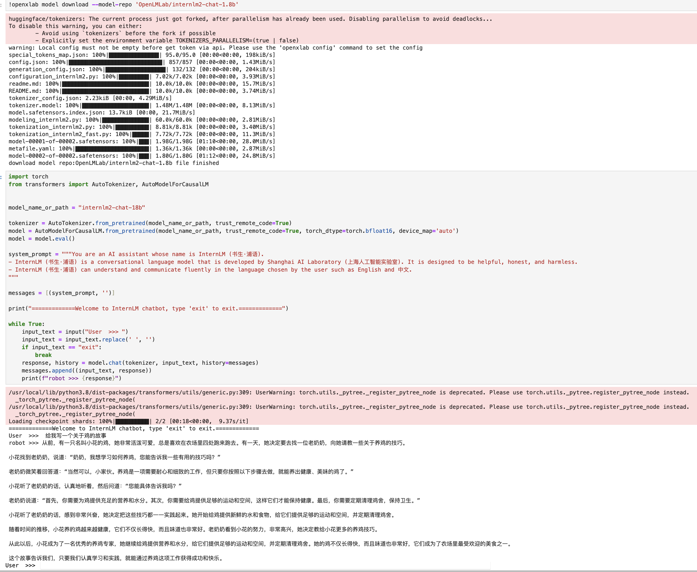

第 2 课作业 在本作业中，我展示了我对 Huggingface 和 OpenXLabs 的了解，并展示了一个命令行使用示例，该示例使用 InternLM2_Chat 1.8B 生成一个关于一只鸡的 300 字中文故事。 TBD：完成作业的高级部分。
在此屏幕截图中，我使用 OpenXlabs 下载 HuggingFace Compatable InternLM2_Chat 1.8B。 我最初对 7B 的速度慢感到困扰，并且无法兼容 BitsandBytes 进行量化。 从技术上讲，它不在说明中，但我假设允许使用不同的 InternLM 模型进行测试。 不管怎样，我可以问 InternLM“给我写一个关于鸡的故事”，它用这个故事回应了。 故事 ZH 文本：

故事文本:
---
从前，有一只名叫小花的鸡，她非常活泼可爱，总是喜欢在农场里四处跑来跑去。有一天，她决定要去找一位老奶奶，向她请教一些关于养鸡的技巧。

小花找到老奶奶，说道：“奶奶，我想学习如何养鸡，您能告诉我一些有用的技巧吗？”

老奶奶微笑着回答道：“当然可以，小家伙。养鸡是一项需要耐心和细致的工作，但只要你按照以下步骤去做，就能养出健康、美味的鸡了。”

小花听了老奶奶的话，认真地听着，然后问道：“您能具体告诉我吗？”

老奶奶说道：“首先，你需要为鸡提供充足的营养和水分。其次，你需要给鸡提供足够的运动和空间，这样它们才能保持健康。最后，你需要定期清理鸡舍，保持卫生。”

小花听了老奶奶的话，感到非常兴奋，她决定把这些技巧都一一实践起来。她开始给鸡提供新鲜的水和食物，给它们提供足够的运动和空间，并定期清理鸡舍。

随着时间的推移，小花养的鸡越来越健康，它们不仅长得快，而且味道也非常好。老奶奶看到小花的努力，非常高兴，她决定教给小花更多的养鸡技巧。

从此以后，小花成为了一名优秀的养鸡专家，她继续给鸡提供营养和水分，给它们提供足够的运动和空间，并定期清理鸡舍。她的鸡不仅长得快，而且味道也非常好，它们成为了农场里最受欢迎的美食之一。

这个故事告诉我们，只要我们认真学习和实践，就能通过养鸡这项工作获得成功和快乐。
---
故事文本English:
---
Once upon a time, there was a chicken named Xiaohua. She was very lively and cute and always liked to run around on the farm. One day, she decided to go to an old woman and ask her for some tips on raising chickens.

Xiaohua found the old grandma and said, "Grandma, I want to learn how to raise chickens. Can you tell me some useful tips?"

The old lady smiled and replied: "Of course, little one. Raising chickens is a job that requires patience and meticulousness, but as long as you follow the following steps, you can raise healthy and delicious chickens."

Xiaohua listened carefully to what the old lady said, and then asked: "Can you tell me specifically?"

The old lady said: "First of all, you need to provide the chickens with adequate nutrition and water. Secondly, you need to provide the chickens with enough exercise and space so that they can stay healthy. Finally, you need to clean the chicken coop regularly to maintain hygiene."

Xiaohua was very excited after hearing what the old lady said, and she decided to put these skills into practice one by one. She began providing the chickens with fresh water and food, providing them with adequate exercise and space, and cleaning the coop regularly.

As time goes by, the chickens raised by Xiaohua become healthier and healthier. Not only do they grow faster, but they also taste very good. The old lady was very happy to see Xiaohua's efforts, and she decided to teach Xiaohua more chicken-raising skills.

Since then, Xiaohua has become an excellent chicken raising expert. She continues to provide nutrition and water to the chickens, provide them with enough exercise and space, and clean the chicken coop regularly. Not only did her chickens grow quickly, but they also tasted so good that they became one of the farm's most popular delicacies.
---
我能看到的唯一问题是它忘记了它们本身就是鸡，但除此之外没有语法问题。 中文558字，英文338字。 由于 HuggingFace 在 InternLM 服务器上被阻止（很可能是由于地理位置），我不得不使用国内服务（OpenXlabs）来下载 HuggingFace 兼容模型。 经过一些尝试和错误，我能够获得该功能。 这个过程大约花了1.5个小时，我希望在完成其他课程的基础作业后，能够完成高级任务。 祝您农历新年愉快！
