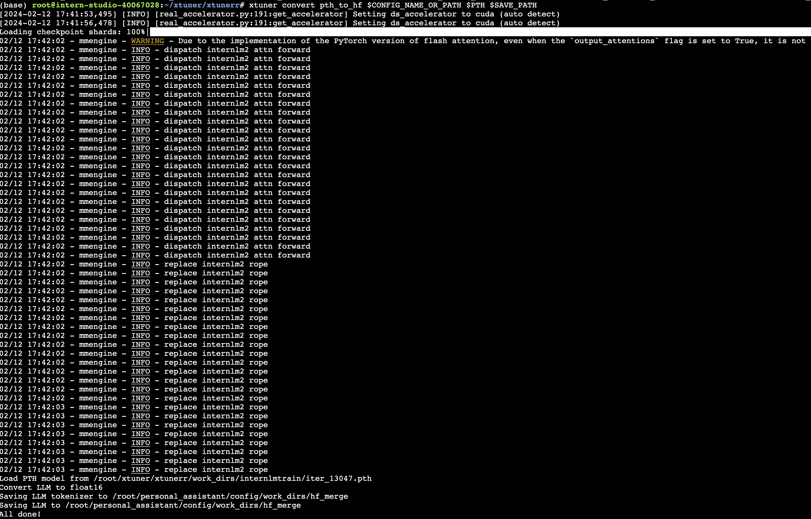
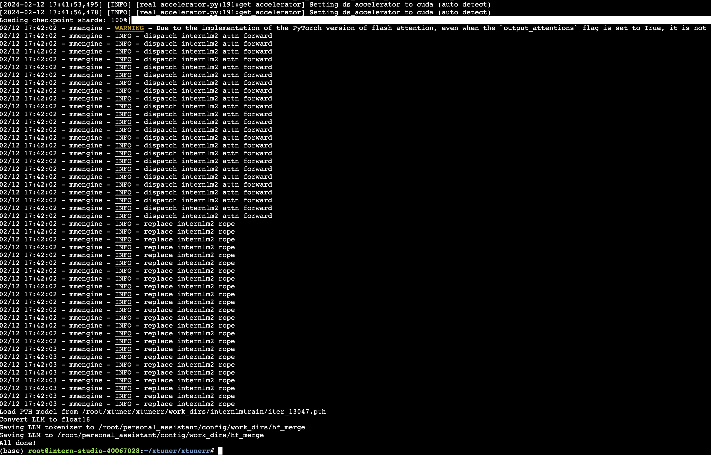

第 4 课作业

所有任务之母，等待大约 2 个小时才能训练人工智能模型，并且兼容性很差。
我最初使用 xtuner 的 PIP 包，但切换环境从源安装它。
从源代码安装它后，我使用杂乱无序的文件来训练 InternLM2-Chat-1.8B。
好吧，经过对配置文件的多次尝试和错误，我终于让它工作了。

老实说，我为自己感到非常自豪，我什至完成了这个项目。
我现在已经完成了整个模型，目前正在转换为 HF 格式。

从开始到结束大约花了3个小时。

我记得还有很多工作要做，但我会等老师告诉全班。
