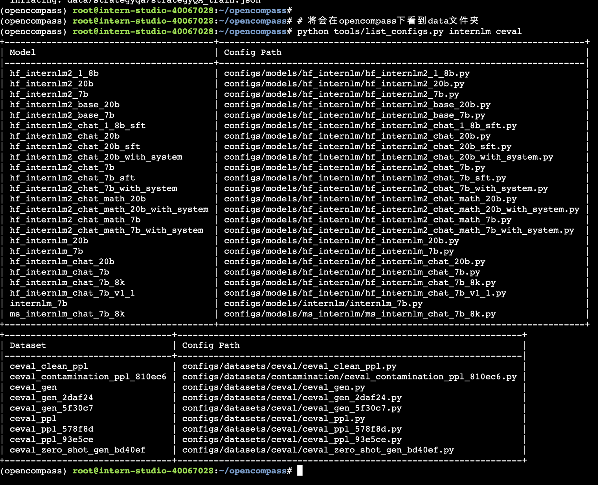
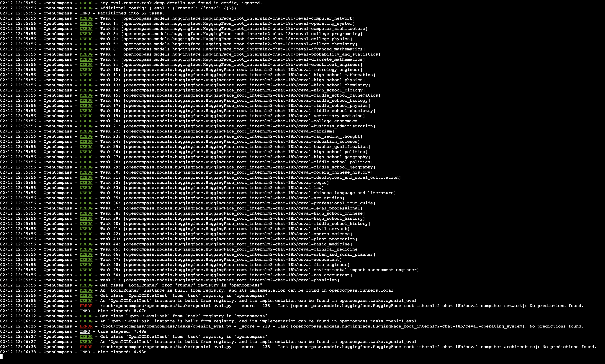
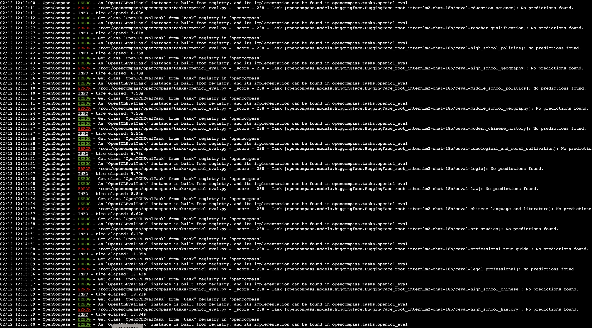
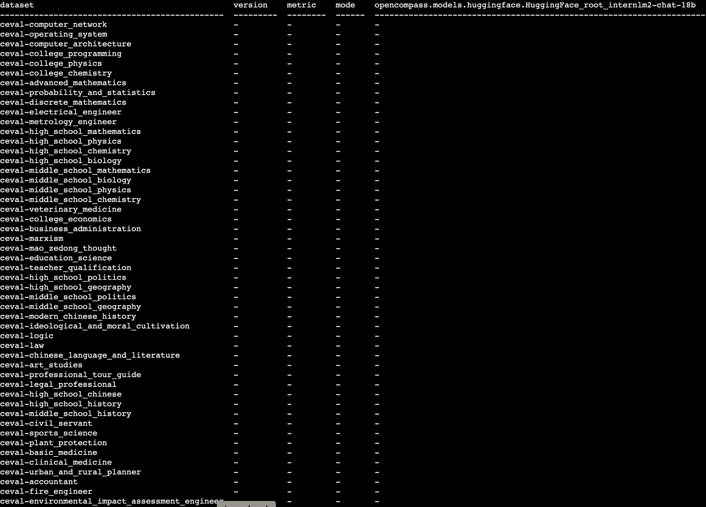

第六课作业

在这次任务中，我努力让 OpenCompass 与 InternLM2 很好地配合工作。
我还要多学习，这项作业还在进行中。
以下是一些使其正常工作的失败尝试。

首先，我阅读了 opencompass 中可用的所有配置。

其次，我启动了评估程序。

第三，我看到了大量的错误。

然后我得到了结果，我很确定没有做出任何预测。

基本作业就这样结束了，我将和班主任一起研究接下来的事情。
