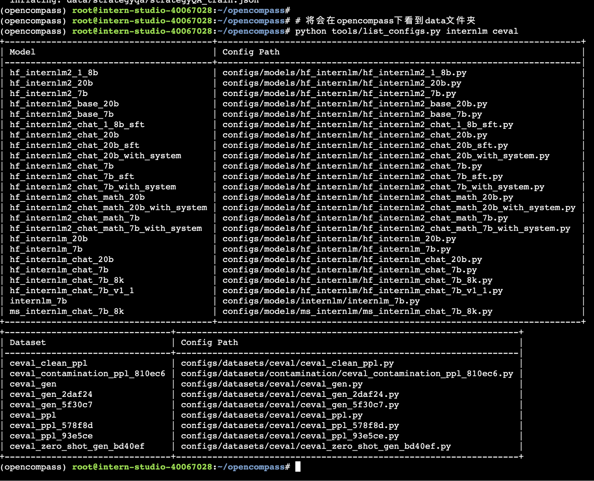

Lesson 6 Homework

During this assignment I struggled with getting OpenCompass to work well with InternLM2.
I will have to study more, this piece of homework is still in progress. 
Here are some failed attempts to get this working properly.

First, I read all the configurations avilable in opencompass.

Second, I started the program to evalute.

Thrid, I saw a large number of errors.

I then got the results back, I'm pretty sure no predictions were made.

This concludes the basic homework, and I will be working with the class instructor to figure out what is after.
